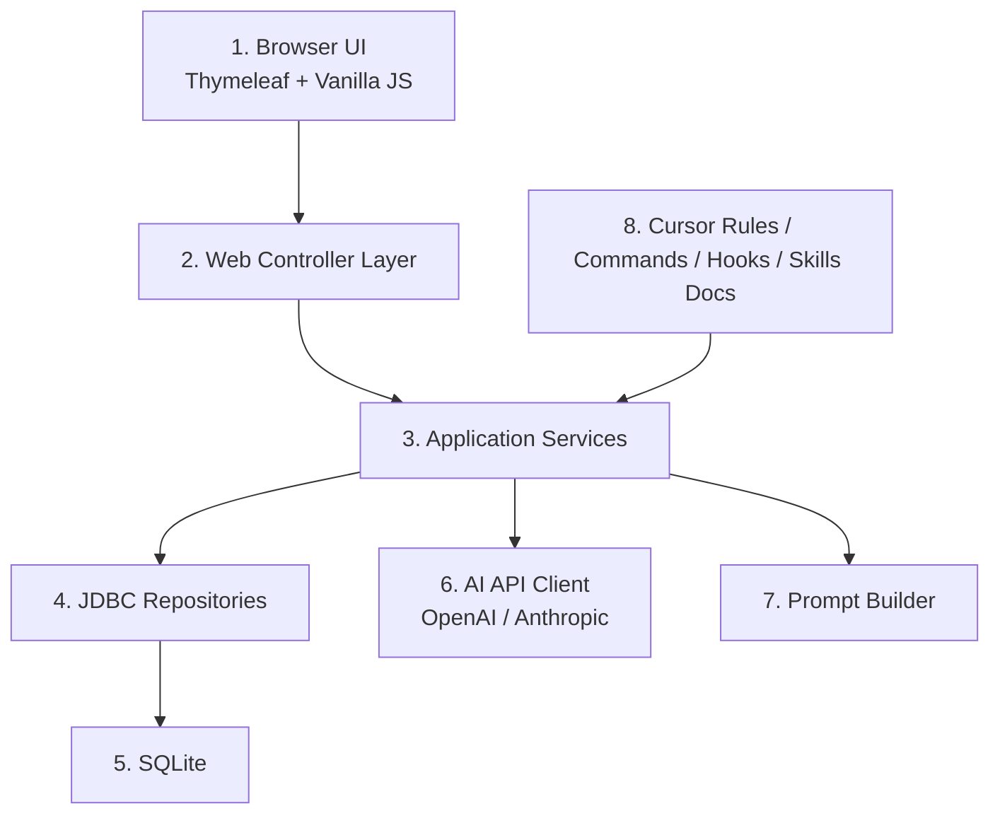

# Design Document: Portfolio Copilot

## Overview
Portfolio Copilot is a local full-stack Spring Boot application designed for an internal seminar about Cursor-centric productivity. It combines a server-rendered web UI, SQLite persistence, and AI API integration (default: OpenAI Chat Completions; optional: Anthropic) to demonstrate a realistic financial advisory workflow: review a portfolio, discuss it with AI, and generate a proposal draft. The repository also includes sample Cursor rules, commands, Claude skills, and hooks to show how specification-driven delivery can be standardized across a team.

## Architecture

### Key Components
- `PortfolioController`: Renders the portfolio list and detail page.
- `AiController`: Accepts discussion prompts and proposal generation requests.
- `PortfolioService`: Loads portfolios with holdings, messages, and proposals.
- `DiscussionService`: Builds AI prompts for advisor discussion and stores message history.
- `ProposalService`: Builds proposal generation prompts and stores proposal drafts.
- AI API Client (`OpenAIPortfolioAiClient` or `AnthropicPortfolioAiClient`): Calls the external AI API through `java.net.http.HttpClient`. Default is OpenAI; set `app.ai.provider=anthropic` to use Anthropic.
- `PromptBuilder`: Creates finance-oriented, portfolio-aware prompts for both chat and proposals.
- JDBC repositories: Use `JdbcClient` for straightforward SQLite access.

## Components and Interfaces

### Web Layer
- `GET /`: Redirects to `/portfolios`.
- `GET /portfolios`: Displays portfolio list and a default selection.
- `GET /portfolios/{id}`: Displays a portfolio detail page.
- `POST /api/portfolios/{id}/chat`: Receives a user message and returns the updated discussion thread.
- `POST /api/portfolios/{id}/proposal`: Generates and returns the latest proposal draft.

### Application Layer
- `PortfolioService`
  - Responsibility: Aggregate portfolio, holdings, messages, and proposal information for UI rendering.
  - Requirements: 2, 4
- `DiscussionService`
  - Responsibility: Persist the user message, call the AI API, persist the assistant message, and return the refreshed thread.
  - Requirements: 3
- `ProposalService`
  - Responsibility: Generate a proposal draft from current portfolio context and discussion history.
  - Requirements: 4
- `PromptBuilder`
  - Responsibility: Keep prompt construction deterministic and testable.
  - Requirements: 3, 4

### Infrastructure Layer
- `OpenAiProperties` / `AnthropicProperties`
  - Store API base URL, model, and API key binding. Provider is selected by `app.ai.provider` (default: openai).
- `OpenAIPortfolioAiClient` (default)
  - Sends requests to OpenAI Chat Completions API (`https://api.openai.com/v1/chat/completions`). Uses `OPENAI_API_KEY`.
- `AnthropicPortfolioAiClient` (when `app.ai.provider=anthropic`)
  - Sends requests to `https://api.anthropic.com/v1/messages` or a configured compatible base URL. Uses `ANTHROPIC_API_KEY`.
- Both throw explicit exceptions on missing configuration or non-success API responses.
- `Repository` classes
  - `PortfolioRepository`
  - `HoldingRepository`
  - `ConversationRepository`
  - `ProposalRepository`

## Data Models

### Domain Models
- `PortfolioSummary`
  - `Long id`
  - `String name`
  - `String clientSegment`
  - `String objective`
  - `String riskProfile`
  - `BigDecimal investedAmount`
  - `Instant updatedAt`
- `Holding`
  - `Long id`
  - `Long portfolioId`
  - `String assetClass`
  - `String ticker`
  - `String instrumentName`
  - `BigDecimal allocationPercent`
  - `BigDecimal marketValue`
- `ConversationMessage`
  - `Long id`
  - `Long portfolioId`
  - `MessageRole role`
  - `String content`
  - `Instant createdAt`
- `ProposalDraft`
  - `Long id`
  - `Long portfolioId`
  - `String title`
  - `String content`
  - `Instant createdAt`

### View Models
- `PortfolioDetailView`
  - Portfolio summary
  - Holding list
  - Conversation message list
  - Optional latest proposal

## Data Storage
- SQLite file under `./data/portfolio-copilot.db`
- Schema initialized through `schema.sql`
- Seed data initialized through `data.sql`

Tables:
- `portfolios`
- `holdings`
- `conversation_messages`
- `proposal_drafts`

## Error Handling
- Missing API key or model configuration:
  - Throw `IllegalStateException`
  - Log with `@Slf4j`
  - Return a clear error payload from API endpoints
- AI API failure:
  - Log request context without leaking secrets
  - Throw a dedicated runtime exception
  - Return a structured error response with HTTP 502
- Portfolio not found:
  - Throw `ResponseStatusException(HttpStatus.NOT_FOUND)`

## Testing Strategy
- Unit tests
  - `PromptBuilderTest`
  - `PortfolioViewAssemblerTest`
  - `ProposalServiceTest` with fake AI client
- Integration tests
  - Controller tests for portfolio page rendering and API endpoints
  - Repository tests with SQLite-backed schema initialization
- Manual verification
  - Start app locally
  - Open portfolio detail
  - Submit an AI discussion prompt
  - Generate proposal draft

## Implementation Considerations
- The UI should stay intentionally simple so the seminar can focus on workflow rather than frontend complexity.
- Business examples should feel relevant to financial advisory and portfolio review scenarios.
- Prompt text must avoid giving regulated investment advice claims and should frame outputs as draft internal support material.
- Repository documentation should explain when to use Cursor rules, commands, skills, hooks, and multi-agent workflows during feature work and future updates.
